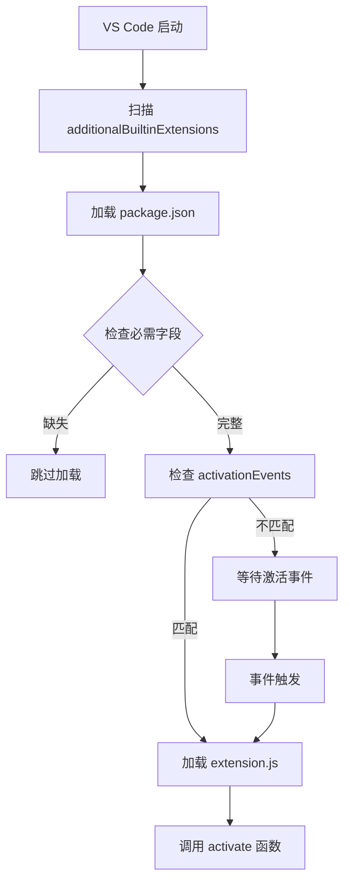

# VS Code additionalBuiltinExtensions 配置指南

## 1. IWorkbenchConstructionOptions 接口定义

根据项目实际使用情况，`additionalBuiltinExtensions` 的类型定义为：

```typescript
interface IWorkbenchConstructionOptions {
  // ... 其他配置
  additionalBuiltinExtensions?: URI[];  // URI 对象数组
}

// URI 对象结构
interface URI {
  scheme: string;      // 协议，如 'http', 'https', 'file'
  authority?: string;  // 域名/主机，如 'localhost:3002'
  path: string;        // 路径，如 '/-/ide/extensions/gitfox-provider'
}
```

### 实际配置示例

```typescript
// 在 bootstrap/src/main.ts 中的配置
additionalBuiltinExtensions: [
  {
    scheme: window.location.protocol.replace(':', ''),  // 'http' 或 'https'
    authority: window.location.host,                     // 'localhost:3002'
    path: '/-/ide/extensions/gitfox-provider',          // 扩展目录路径
  }
]
```

## 2. 扩展被识别但不激活的常见原因

### A. package.json 配置问题

#### 必需字段缺失或错误
```json
{
  "name": "gitfox-provider",           // ✅ 必需
  "publisher": "gitfox",                // ✅ 必需
  "version": "1.0.0",                   // ✅ 必需
  "engines": {
    "vscode": "^1.109.0"                // ✅ 必需：指定 VS Code API 版本
  }
}
```

#### Web 扩展特有字段
```json
{
  "browser": "./dist/extension.js",    // ✅ Web 扩展使用 browser 而非 main
  "main": "./dist/extension.js",       // ⚠️ 同时保留 main 以支持桌面版（可选）
  
  "activationEvents": ["*"],           // ✅ 激活事件：'*' 表示始终激活
  
  "contributes": {},                   // ✅ 必需字段，即使为空对象也要有
  
  "capabilities": {                    // ⚠️ 可选但推荐
    "untrustedWorkspaces": {
      "supported": true
    }
  }
}
```

### B. 文件路径和服务问题

#### 扩展文件必须可通过 HTTP 访问
```javascript
// vite.config.ts 中配置静态文件服务
export default defineConfig({
  server: {
    fs: {
      allow: [
        resolve(__dirname),
        resolve(__dirname, 'extensions'),  // ✅ 允许访问扩展目录
      ],
    },
  },
  plugins: [
    {
      name: 'serve-extensions',
      configureServer(server) {
        server.middlewares.use((req, res, next) => {
          if (req.url?.startsWith('/-/ide/extensions/')) {
            // 提供扩展文件服务
            const extensionPath = req.url.replace('/-/ide/extensions/', '');
            const filePath = resolve(__dirname, 'extensions', extensionPath);
            // ...
          }
          next();
        });
      },
    },
  ],
});
```

#### 扩展目录结构要求
```
extensions/
└── gitfox-provider/
    ├── package.json          // ✅ 必需：扩展清单
    ├── package.nls.json      // ⚠️ 可选：国际化
    └── dist/
        └── extension.js      // ✅ 必需：编译后的扩展代码
```

### C. 扩展代码问题

#### 激活函数（activate）必须正确导出
```typescript
// ✅ 正确：导出 activate 和 deactivate 函数
export function activate(context: vscode.ExtensionContext) {
  console.log('Extension activating...');
  // 注册功能
}

export function deactivate() {
  console.log('Extension deactivated');
}

// ❌ 错误：没有导出或导出方式错误
function activate() { /* ... */ }  // 缺少 export
export default { activate };        // 不应使用 default export
```

#### 模块格式要求
```javascript
// package.json 中的构建配置
{
  "scripts": {
    "build": "esbuild src/extension.ts --bundle --outfile=dist/extension.js --external:vscode --format=esm --platform=browser --target=es2020 --minify"
  }
}
```

关键参数：
- `--format=esm`: 必须使用 ES Module 格式
- `--platform=browser`: 目标平台为浏览器
- `--external:vscode`: vscode API 作为外部依赖
- `--target=es2020`: 目标 ES 版本

## 3. Web 扩展的 package.json 完整示例

```json
{
  "name": "gitfox-provider",
  "displayName": "GitFox File System Provider",
  "description": "Provides gitfox:// file system and authentication for GitFox WebIDE",
  "version": "1.0.0",
  "publisher": "gitfox",
  
  "engines": {
    "vscode": "^1.109.0"
  },
  
  "categories": ["Other"],
  
  "activationEvents": ["*"],
  
  "main": "./dist/extension.js",
  "browser": "./dist/extension.js",
  
  "capabilities": {
    "untrustedWorkspaces": {
      "supported": true
    }
  },
  
  "contributes": {},
  
  "scripts": {
    "build": "esbuild src/extension.ts --bundle --outfile=dist/extension.js --external:vscode --format=esm --platform=browser --target=es2020 --minify"
  },
  
  "devDependencies": {
    "@types/vscode": "^1.95.0",
    "esbuild": "^0.19.0",
    "typescript": "^5.3.0"
  }
}
```

## 4. Web 扩展的激活机制

### 激活流程



### activationEvents 配置选项

```json
{
  "activationEvents": [
    "*",                              // 始终激活（启动时）
    "onLanguage:typescript",          // 打开特定语言文件时
    "onCommand:extension.command",    // 执行特定命令时
    "onFileSystem:gitfox",            // 访问特定文件系统时
    "onView:explorer",                // 打开特定视图时
    "workspaceContains:**/.git",      // 工作区包含特定文件时
    "onStartupFinished"               // VS Code 启动完成后
  ]
}
```

### 扩展激活代码示例

```typescript
import * as vscode from 'vscode';

export function activate(context: vscode.ExtensionContext) {
  console.log('[Extension] Activating...');

  // 1. 从全局对象获取配置（由 bootstrap 注入）
  const config = (globalThis as any).__GITFOX_CONFIG__;
  if (!config) {
    console.error('[Extension] Config not found');
    return;
  }

  // 2. 注册文件系统提供者
  const fsProvider = new GitFoxFileSystemProvider(config);
  context.subscriptions.push(
    vscode.workspace.registerFileSystemProvider('gitfox', fsProvider, {
      isCaseSensitive: true,
      isReadonly: false,
    })
  );

  // 3. 注册认证提供者
  const authProvider = new GitFoxAuthProvider(config);
  context.subscriptions.push(
    vscode.authentication.registerAuthenticationProvider(
      'gitfox',
      'GitFox',
      authProvider,
      { supportsMultipleAccounts: false }
    )
  );

  console.log('[Extension] Activated successfully');
}

export function deactivate() {
  console.log('[Extension] Deactivated');
}
```

## 5. 调试扩展加载问题

### 开启 VS Code 扩展日志

在浏览器控制台中检查以下日志：

```javascript
// 1. 检查扩展是否被发现
// 应该看到类似的日志：
"[ExtensionScanner] Found additional builtin location extensions"

// 2. 检查扩展是否被加载
// 应该看到：
"[ExtensionService] Loading extension: gitfox-provider"

// 3. 检查扩展是否激活
// 应该看到：
"[Extension] Activating..."
"[Extension] Activated successfully"
```

### 网络请求检查

在浏览器开发者工具的 Network 标签中，确认以下请求：

```
✅ GET /-/ide/extensions/gitfox-provider/package.json  (200 OK)
✅ GET /-/ide/extensions/gitfox-provider/dist/extension.js  (200 OK)
```

如果看不到 `extension.js` 请求：
- 检查 package.json 的 `browser` 字段路径是否正确
- 检查 extension.js 是否已构建
- 检查服务器是否正确提供该文件

### 常见错误和解决方案

| 症状 | 原因 | 解决方案 |
|-----|------|---------|
| 扩展目录被扫描但未加载 | package.json 缺少必需字段 | 添加 `browser`、`activationEvents`、`contributes` |
| extension.js 404 错误 | 构建输出路径错误 | 检查 package.json 的 `browser` 字段是否匹配实际文件 |
| activate 未被调用 | activationEvents 不匹配 | 使用 `"*"` 确保始终激活，或检查事件配置 |
| 模块加载错误 | 构建格式错误 | 确保使用 `--format=esm --platform=browser` |
| vscode API 未定义 | 未标记为外部依赖 | 添加 `--external:vscode` 构建参数 |

## 6. 完整配置检查清单

### Bootstrap 配置（main.ts）
- [ ] additionalBuiltinExtensions 使用完整 URI 对象格式
- [ ] URI.scheme 正确（http/https）
- [ ] URI.authority 包含主机和端口
- [ ] URI.path 指向正确的扩展目录

### 服务器配置（vite.config.ts）
- [ ] server.fs.allow 包含 extensions 目录
- [ ] 配置了提供扩展文件的中间件
- [ ] 扩展路径可以通过 HTTP 访问

### 扩展 package.json
- [ ] name, publisher, version, engines 字段存在
- [ ] engines.vscode 版本正确
- [ ] browser 字段指向正确的文件
- [ ] activationEvents 配置正确（建议使用 "*"）
- [ ] contributes 字段存在（即使为空）

### 扩展代码
- [ ] 导出 activate 和 deactivate 函数
- [ ] activate 函数签名正确：`(context: vscode.ExtensionContext) => void`
- [ ] 使用 ESM 格式构建
- [ ] vscode API 标记为外部依赖

### 构建产物
- [ ] dist/extension.js 文件存在
- [ ] 文件大小合理（通常几 KB）
- [ ] 文件可以通过 HTTP 访问

## 7. VS Code Web 扩展资源

### 官方文档
- [Web Extensions](https://code.visualstudio.com/api/extension-guides/web-extensions)
- [Extension Activation](https://code.visualstudio.com/api/references/activation-events)
- [Extension Manifest](https://code.visualstudio.com/api/references/extension-manifest)

### 相关 API
- `vscode.workspace.registerFileSystemProvider()`
- `vscode.authentication.registerAuthenticationProvider()`
- `vscode.ExtensionContext`

## 8. GitFox 项目特定配置

### 配置传递机制

```typescript
// 1. Bootstrap 在 window 上注入配置
(window as any).__GITFOX_CONFIG__ = {
  accessToken: this.accessToken,
  projectInfo: { owner, repo, ref },
  userInfo: { id, username, name, email },
  apiClient: this.apiClient,
};

// 2. 扩展从 globalThis 读取配置
const config = (globalThis as any).__GITFOX_CONFIG__;

// 3. 扩展使用配置注册服务
const fsProvider = new GitFoxFileSystemProvider(config);
```

### 时序要求

```typescript
// Bootstrap 必须按以下顺序执行：
async loadWorkbench() {
  // 1. 先在 window 上设置 __GITFOX_CONFIG__
  (window as any).__GITFOX_CONFIG__ = { /* ... */ };
  
  // 2. 然后配置 additionalBuiltinExtensions
  const config = {
    additionalBuiltinExtensions: [{ /* ... */ }],
    // ...
  };
  
  // 3. 最后加载 workbench
  html = html.replace('{{WORKBENCH_WEB_CONFIGURATION}}', JSON.stringify(config));
  document.body.innerHTML = html;
}
```

---

## 总结

**扩展被识别但不激活的核心原因**通常是：

1. **package.json 配置不完整**：缺少 `browser`、`activationEvents` 或 `contributes` 字段
2. **文件路径不可访问**：extension.js 无法通过 HTTP 加载
3. **构建格式错误**：未使用 ESM 格式或未标记 vscode 为外部依赖
4. **激活事件不匹配**：activationEvents 配置错误导致扩展不被激活

解决方法是系统性地检查上述配置清单，并通过浏览器控制台和网络面板验证每个步骤。
